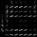
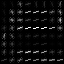
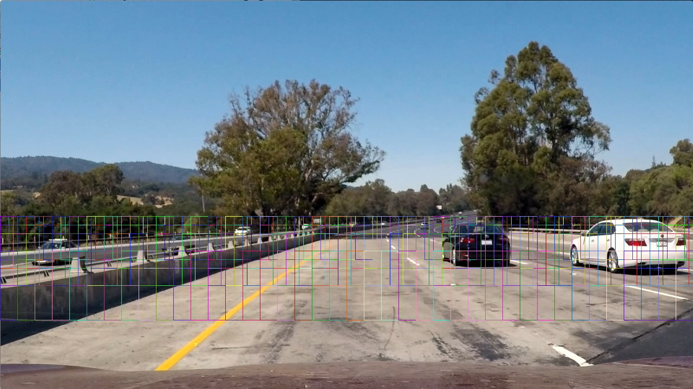
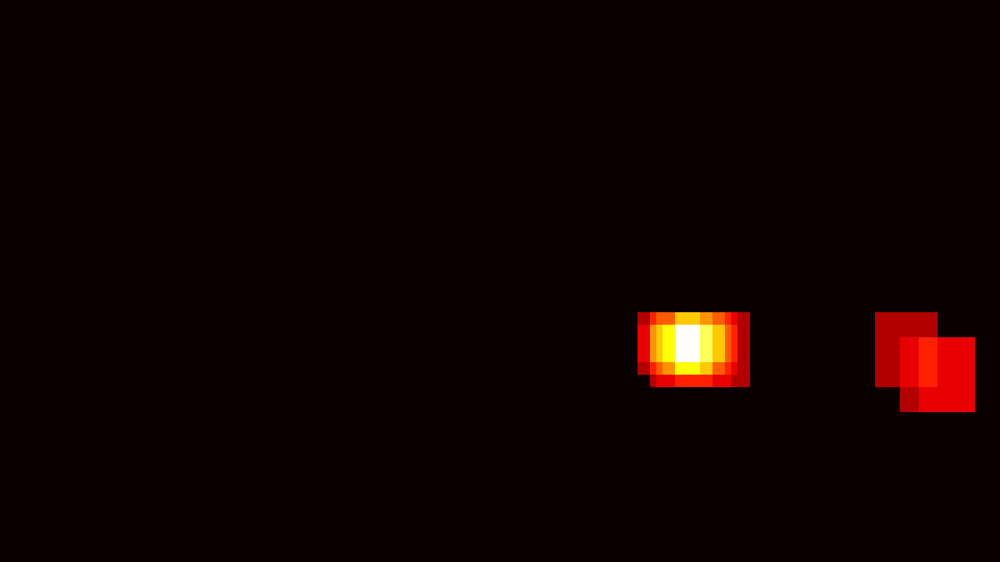
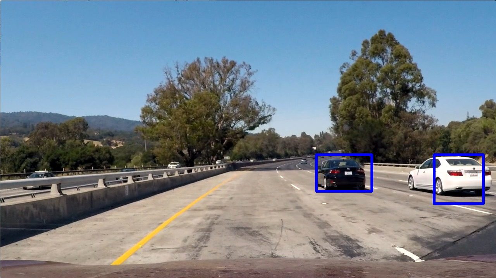
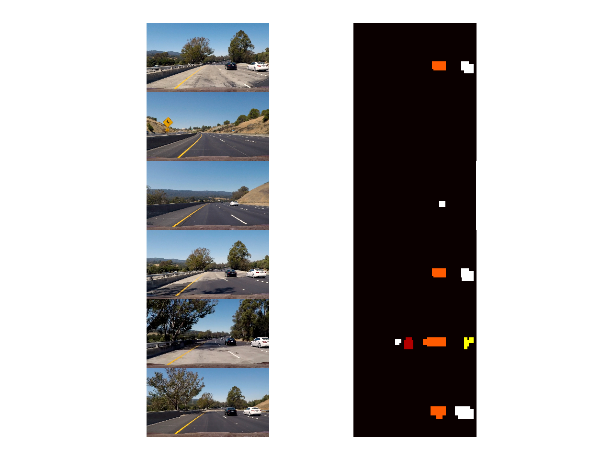
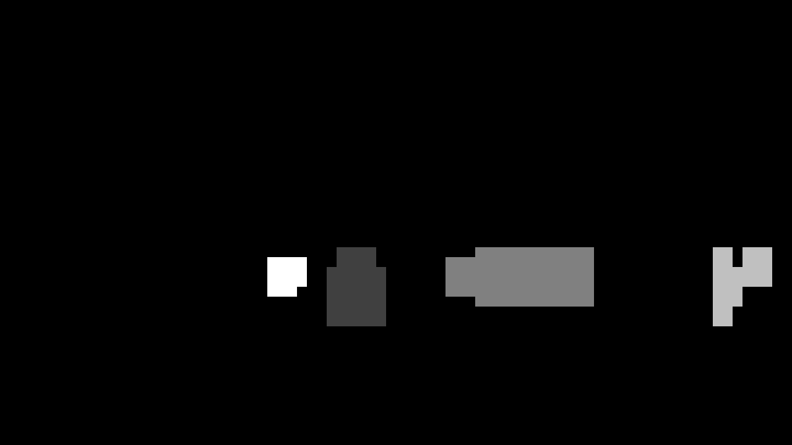
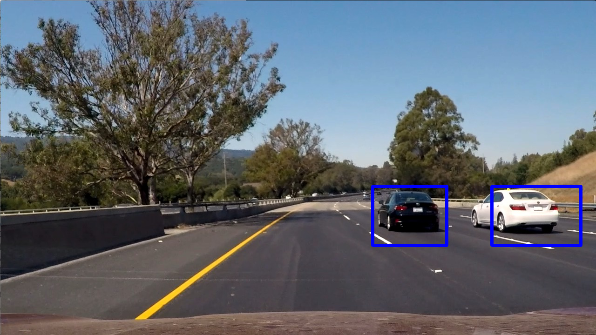

**Vehicle Detection Project**

The goals / steps of this project are the following:

* Perform a Histogram of Oriented Gradients (HOG) feature extraction on a labeled training set of images and train a classifier Linear SVM classifier
* Optionally, you can also apply a color transform and append binned color features, as well as histograms of color, to your HOG feature vector. 
* Note: for those first two steps don't forget to normalize your features and randomize a selection for training and testing.
* Implement a sliding-window technique and use your trained classifier to search for vehicles in images.
* Run your pipeline on a video stream (start with the test_video.mp4 and later implement on full project_video.mp4) and create a heat map of recurring detections frame by frame to reject outliers and follow detected vehicles.
* Estimate a bounding box for vehicles detected.

## [Rubric](https://review.udacity.com/#!/rubrics/513/view) Points
### Here I will consider the rubric points individually and describe how I addressed each point in my implementation.  

---
### Writeup / README

#### 1. Provide a Writeup / README that includes all the rubric points and how you addressed each one.  You can submit your writeup as markdown or pdf.  [Here](https://github.com/udacity/CarND-Vehicle-Detection/blob/master/writeup_template.md) is a template writeup for this project you can use as a guide and a starting point.  

You're reading it!

### Histogram of Oriented Gradients (HOG)

#### 1. Explain how (and identify where in your code) you extracted HOG features from the training images.

The code for this step is contained in the first code cell of the IPython notebook (or in lines 7 through 26 of the file called `features.py`). This function is from the udacity lectures. 

I started by reading in all the `vehicle` and `non-vehicle` images.  Here is an example of one of each of the `vehicle` and `non-vehicle` classes:

I then explored different color spaces and different `skimage.hog()` parameters (`orientations`, `pixels_per_cell`, and `cells_per_block`).  I grabbed random images from each of the two classes and displayed them to get a feel for what the `skimage.hog()` output looks like.

I tried different kinds of color spaces but ended up using `YCrCB` since it gave me the best results. Here is an example using the `YCrCb` color space and HOG parameters of `orientations=9`, `pixels_per_cell=(8, 8)` and `cells_per_block=(2, 2)` on the three different channels on an image of a car:




#### 2. Explain how you settled on your final choice of HOG parameters.

I tried many different color spaces but ended up getting the best result using `YCrCB` color space. I did not tune the other parameters any further since I already got a accuracy of 98%.

#### 3. Describe how (and identify where in your code) you trained a classifier using your selected HOG features (and color features if you used them).

The code for training the classifier can be found in `classifier.py`. I ended up using a linear support vector machine classifier and I trained the classifier using only the HOG parameter. The data was then scaled using sklearn StandardScaler.

Then I ran a parameter tuning of `{'C':[1, 10]}`

In the end I got be best result by using C value: 1. With these parameter I got an accuracy of: 98%

### Sliding Window Search

#### 1. Describe how (and identify where in your code) you implemented a sliding window search.  How did you decide what scales to search and how much to overlap windows?

I did not use a sliding window search. However I used the `find_car()`function that was provided in the lectures and the windows that I search through can be seen below.

#### 2. Show some examples of test images to demonstrate how your pipeline is working.  What did you do to optimize the performance of your classifier?

Ultimately I searched using all channels in the `YCrCb` color space, from which I extracted HOG features. I also extracted additional features by color histograming and spacial binning.

I used the `find_car()` function that can be found in `sliding_window.py`, which returned boxes for every positive detection of a car. I ran this function with different start and stop in y-direction as well as with different scaling. Then I appended the boxes to a memory that could hold boxes from maximum 15 images.

The memory of boxes was then converted to a heatmap. The heatmap was then filtered by a threshold of 48.

See below for heatmap examples and images of the bounding boxes.

---

### Video Implementation

#### 1. Provide a link to your final video output.  Your pipeline should perform reasonably well on the entire project video (somewhat wobbly or unstable bounding boxes are ok as long as you are identifying the vehicles most of the time with minimal false positives.)

Here's a [link to my video result](./output_video/project_video.mp4)

#### 2. Describe how (and identify where in your code) you implemented some kind of filter for false positives and some method for combining overlapping bounding boxes.

I recorded the positions of positive detections in each frame of the video. From the positive detections I saved the boxes in memory that could hold the memory of boxes from 15 frames. From that memory of boxes from 15 frames I created a heatmap and then thresholded that map with a threshold of 15. 

I then used `scipy.ndimage.measurements.label()` to identify individual blobs in the heatmap. I then assumed each blob corresponded to a vehicle. I constructed bounding boxes to cover the area of each blob detected.  

Here's an example result of `scipy.ndimage.measurements.label()` and the bounding boxes then overlaid on an example image.

### Here are six frames and their corresponding heatmaps:

Six frames and their corresponding heatmaps before filtering with 10 images averaging.

### Here is the output of `scipy.ndimage.measurements.label()` on the integrated heatmap from all six frames:







### Here the resulting bounding boxes are drawn onto the last frame in the series:

---

### Discussion

#### 1. Briefly discuss any problems / issues you faced in your implementation of this project.  Where will your pipeline likely fail?  What could you do to make it more robust?

The problem my pipeline was facing was that I got too many false positives, this was handled by adding additional filtering over 15 frames is memory. This resulted in a much more stable detection, less wobbly bounding box and also fewer false positives. 

To increase the pipeline even further I would have tried a different classifier and maybe try the YOLO approach, even though it is not the best it seems good enough and fast.

Currently my pipeline have difficulties separating two cars as can be seen in the movie when the black car is overtaking the white car, the boxes goes into each other. And also have problem detecting a white car at a distance.

